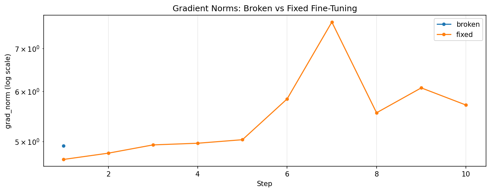

(tutorials-debugging-tools)=

# Debugging Training Instability

This tutorial shows how to use LightlyTrain's debugging tools to find and fix
numerical instability in fine-tuning. We build a small synthetic dataset, train
a ResNet18 with one intentionally unstable layer, and use gradient norm logging
and `DebugUnderflowOverflow` to locate the problem.

```{note}
The debugging tools (`debug_args`) are only available in the fine-tuning
commands (`train_image_classification`, `train_object_detection`, …), not in
self-supervised `pretrain`. This tutorial uses `train_image_classification`.
```

## Install Dependencies

```bash
pip install lightly-train torch torchvision matplotlib
```

## Generate a Synthetic Dataset

We use a small synthetic dataset so the tutorial is fully reproducible offline
— no downloads required.

```python
# setup_data.py
from pathlib import Path

import numpy as np
from PIL import Image

CLASS_NAMES = [
    "airplane", "automobile", "bird", "cat", "deer",
    "dog", "frog", "horse", "ship", "truck",
]
DATA_DIR = Path("datasets/debugging_tutorial")
NUM_TRAIN_PER_CLASS = 32
NUM_VAL_PER_CLASS = 8
IMAGE_SIZE = (96, 96)

for split, num_per_class in (("train", NUM_TRAIN_PER_CLASS), ("val", NUM_VAL_PER_CLASS)):
    split_idx = 0 if split == "train" else 1
    for class_idx, class_name in enumerate(CLASS_NAMES):
        split_dir = DATA_DIR / split / class_name
        for img_idx in range(num_per_class):
            seed = split_idx * 1_000_000 + class_idx * 10_000 + img_idx
            rng = np.random.default_rng(seed)
            pixels = rng.integers(0, 256, size=(*IMAGE_SIZE, 3), dtype=np.uint8)
            split_dir.mkdir(parents=True, exist_ok=True)
            Image.fromarray(pixels, mode="RGB").save(split_dir / f"img_{img_idx:04d}.png")

print(f"Dataset built at {DATA_DIR.resolve()}.")
```

```bash
python setup_data.py
```

## Build the Broken Model

We define an `UnstableReLU` that overflows in fp16, and monkey-patch
`torchvision.models.resnet18` so LightlyTrain's internally-built model gets it.

```python
# broken_model.py
from contextlib import contextmanager

import torch
from torch import nn
from torchvision.models._api import BUILTIN_MODELS


class UnstableReLU(nn.Module):
    def __init__(self, scale: float = 1.0):
        super().__init__()
        self.scale = float(scale)

    def forward(self, x: torch.Tensor) -> torch.Tensor:
        # Force computation into float16. Without this cast, PyTorch's autocast
        # keeps `torch.exp` in float32 and the layer would NOT overflow in
        # mixed precision training — a real-world gotcha when porting models.
        x_fp16 = x.to(dtype=torch.float16)
        out_fp16 = torch.where(
            x_fp16 > 0,
            torch.exp(x_fp16 * self.scale),
            torch.zeros_like(x_fp16),
        )
        return out_fp16.to(dtype=x.dtype)


@contextmanager
def patched_resnet18(scale: float = 1.0):
    import torchvision.models
    import torchvision.models.resnet

    original = torchvision.models.resnet.resnet18
    original_builtin = BUILTIN_MODELS["resnet18"]

    def broken(*args, **kwargs):
        model = original(*args, **kwargs)
        model.layer2[1].relu = UnstableReLU(scale=scale)
        return model

    # Patch all three references — torchvision.models.get_model goes through
    # the BUILTIN_MODELS registry, so patching only one is not enough.
    torchvision.models.resnet18 = broken
    torchvision.models.resnet.resnet18 = broken
    BUILTIN_MODELS["resnet18"] = broken
    try:
        yield
    finally:
        torchvision.models.resnet18 = original
        torchvision.models.resnet.resnet18 = original
        BUILTIN_MODELS["resnet18"] = original_builtin
```

`exp(x)` overflows in float16 for `x > ~11`. The `_features` prefix in the
`DebugUnderflowOverflow` log lines is added by Fabric; the original module is
`model.layer2[1].relu`.

## Run with `DebugUnderflowOverflow`

```python
# broken_finetuning.py
from pathlib import Path

import lightly_train

from broken_model import patched_resnet18
from setup_data import CLASS_NAMES

DATA = {
    "train": Path("datasets/debugging_tutorial/train"),
    "val": Path("datasets/debugging_tutorial/val"),
    "classes": {i: name for i, name in enumerate(CLASS_NAMES)},
}

if __name__ == "__main__":
    with patched_resnet18():
        lightly_train.train_image_classification(
            out="out/debugging_broken",
            data=DATA,
            model="torchvision/resnet18",
            precision="16-mixed",
            accelerator="cpu",
            steps=10,
            batch_size=8,
            model_args={"lr": 1e-3},
            debug_args={
                "underflow_overflow": {
                    "enabled": True,
                    "max_frames_to_save": 21,
                }
            },
            save_checkpoint_args={"save_last": False},
            overwrite=True,
        )
```

```bash
python broken_finetuning.py
```

`DebugUnderflowOverflow` registers forward hooks on every module and aborts at
the first `inf`/`nan`:

```
ValueError: DebugUnderflowOverflow: inf/nan detected, aborting as there is no
point running further. Please check the debug log file for the activation
values prior to this event.
```

The frame dump is at
`out/debugging_broken/debug/underflow_overflow_rank0.log`. The smoking gun is
at the bottom:

```
                  _forward_module.model.backbone._features.layer2.1.relu UnstableReLU
9.54e-07 1.61e+01 input[0]
0.00e+00      inf output
```

`inf` output from a normal-range input — that's the unstable layer.

## See It as a Gradient-Norm Problem

`DebugUnderflowOverflow` aborts training. To see the gradient-norm pattern that
leads there, run the broken model **without** the monitor. We use `scale=0.8`
so the instability isn't instantaneous — it gives one normal step before
everything goes NaN.

```python
# broken_diagnostic.py
from pathlib import Path

import lightly_train

from broken_model import patched_resnet18
from setup_data import CLASS_NAMES

DATA = {  # same as broken_finetuning.py
    "train": Path("datasets/debugging_tutorial/train"),
    "val": Path("datasets/debugging_tutorial/val"),
    "classes": {i: name for i, name in enumerate(CLASS_NAMES)},
}

if __name__ == "__main__":
    with patched_resnet18(scale=0.8):
        lightly_train.train_image_classification(
            out="out/debugging_broken_diagnostic",
            data=DATA,
            model="torchvision/resnet18",
            precision="16-mixed",
            accelerator="cpu",
            steps=10,
            batch_size=8,
            model_args={"lr": 1e-3},
            save_checkpoint_args={"save_last": False},
            overwrite=True,
        )
```

```bash
python broken_diagnostic.py
```

Console output:

```
Train Step  1/10 | train_loss: 2.2967 | grad_norm: 4.9266
Train Step  2/10 | train_loss: 2.3861 | grad_norm:  nan
Train Step  3/10 | train_loss:  nan   | grad_norm:  nan
...
Train Step 10/10 | train_loss:  nan   | grad_norm:  nan
```

Step 1 looks clean. Step 2 has a **finite loss** but **NaN gradient** — the
unstable layer overflowed in the **backward pass** (corrupting gradients)
while the forward pass still produced finite logits. From step 3 onward, every
step is NaN.

## Compare with a Healthy Run

```python
# fixed_finetuning.py
from pathlib import Path

import lightly_train

from setup_data import CLASS_NAMES

DATA = {  # same as broken_finetuning.py
    "train": Path("datasets/debugging_tutorial/train"),
    "val": Path("datasets/debugging_tutorial/val"),
    "classes": {i: name for i, name in enumerate(CLASS_NAMES)},
}

if __name__ == "__main__":
    lightly_train.train_image_classification(
        out="out/debugging_fixed",
        data=DATA,
        model="torchvision/resnet18",
        precision="16-mixed",
        accelerator="cpu",
        steps=10,
        batch_size=8,
        model_args={"lr": 1e-3},
        save_checkpoint_args={"save_last": False},
        overwrite=True,
    )
```

```bash
python fixed_finetuning.py
```

Console output:

```
Train Step  1/10 | train_loss: 2.3036 | grad_norm: 4.6890
Train Step  2/10 | train_loss: 2.3426 | grad_norm: 4.7964
Train Step  3/10 | train_loss: 2.3777 | grad_norm: 4.9420
Train Step  4/10 | train_loss: 2.2944 | grad_norm: 4.9719
Train Step  5/10 | train_loss: 2.3872 | grad_norm: 5.0357
Train Step  6/10 | train_loss: 2.4790 | grad_norm: 5.8368
Train Step  7/10 | train_loss: 2.4271 | grad_norm: 7.7066
Train Step  8/10 | train_loss: 2.2819 | grad_norm: 5.5508
Train Step  9/10 | train_loss: 2.4061 | grad_norm: 6.0739
Train Step 10/10 | train_loss: 2.4807 | grad_norm: 5.7085
```

Stable gradient norms in a healthy range (≈ 4.7–7.7) — the baseline.

## Visualize the Comparison

```python
# visualize.py
import re
from pathlib import Path

import matplotlib.pyplot as plt

LINE = re.compile(
    r"Train\s+Step\s+(?P<step>\d+)/\d+.*?grad_norm:\s*(?P<norm>\S+)"
)


def parse(path: Path):
    steps, norms = [], []
    for line in path.read_text().splitlines():
        m = LINE.search(line)
        if not m:
            continue
        try:
            v = float(m["norm"])
        except ValueError:
            continue
        if v == v:  # drop NaN
            steps.append(int(m["step"]))
            norms.append(v)
    return steps, norms


fig, ax = plt.subplots()
for label, log in [
    ("fixed (no patch)", "out/debugging_fixed/train.log"),
    ("broken (scale=0.8)", "out/debugging_broken_diagnostic/train.log"),
]:
    steps, norms = parse(Path(log))
    if steps:
        ax.plot(steps, norms, marker="o", label=label)
ax.set_yscale("log")
ax.set_xlabel("Step")
ax.set_ylabel("grad_norm (log scale)")
ax.set_title("Gradient norms: broken vs fixed")
ax.legend()
ax.grid(True, alpha=0.3)
fig.tight_layout()
fig.savefig("gradient_norm_comparison.png", dpi=120, bbox_inches="tight")
```

The broken run contributes one data point (step 1, NaN-filtered); the fixed
run contributes ten.



The fix is to use the standard ReLU — i.e. don't enter `patched_resnet18()`.

## Next Steps

- The same `debug_args` shape works for `train_object_detection` and
  `train_instance_segmentation`.
- For the full `debug_args` reference, see the LightlyTrain API documentation.
- For implementation details on gradient-norm logging and
  `DebugUnderflowOverflow`, see `src/lightly_train/_debug/`.

That's the debugging workflow — gradient norms catch the symptom,
`DebugUnderflowOverflow` finds the cause. 🎉
