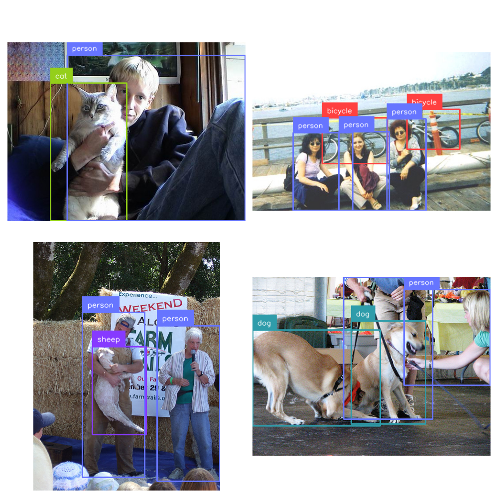

(tutorials-yolo)=

# Object Detection with Ultralytics' YOLO

This tutorial demonstrates how to pretrain a YOLO model using LightlyTrain and then fine-tune it for object detection using the `ultralytics` framework. To this end, we will first pretrain on a [25k image subset](https://github.com/giddyyupp/coco-minitrain) of the [COCO dataset](https://cocodataset.org/#home) (only the images, no labels!), and subsequently finetune on the labeled [PASCAL VOC dataset](http://host.robots.ox.ac.uk/pascal/VOC/).

```{warning}
Using Ultralytics models might require a commercial Ultralytics license. See the
[Ultralytics website](https://www.ultralytics.com/license) for more information.
```

## Install Dependencies

Install the required packages:

- `lightly-train` for pretraining, with support for `ultralytics`' YOLO models
- [`supervision`](https://github.com/roboflow/supervision) to visualize some of the annotated pictures

```bash
pip install "lightly-train[ultralytics]" "supervision==0.25.1"
```

## Pretraining on COCO-minitrain
We can download the COCO-minitrain dataset (25k images) directly from HuggingFace:
```bash
wget https://huggingface.co/datasets/bryanbocao/coco_minitrain/resolve/main/coco_minitrain_25k.zip
```
And unzip it:
```bash
unzip coco_minitrain_25k.zip
```
Since Lightly**Train** does not require any labels, we can can confidently delete all the labels:
```bash
rm -rf coco_minitrain_25k/labels
```
And start pretraining a YOLO11s model:
````{tab} Python
```python
# pretrain_yolo.py
import lightly_train

if __name__ == "__main__":
    # Pretrain with LightlyTrain.
    lightly_train.train(
        out="out/coco_minitrain_pretrain",  # Output directory.
        model="ultralytics/yolo11s.yaml",   # Pass the YOLO model (use .yaml ending to start with random weights).
        data="coco_minitrain_25k/images",   # Path to a directory with training images.
        epochs=100,                         # Adjust epochs for shorter training.
        batch_size=64,                      # Adjust batch size based on hardware.
    )
```
````

````{tab} Command Line
```bash
lightly-train --out=out/coco_minitrain_pretrain --model=ultralytics/yolo11s.yaml --data=coco_minitrain_25k/images --epochs=100 --batch-size=64
```
````
And just like that you pretrained a YOLO11s backbone! 🥳 This backbone can't solve any task yet, so in the next step we will finetune it on the PASCAL VOC dataset.

## Finetuning on PASCAL VOC

### Download the PASCAL VOC Dataset
We can download the dataset directly using Ultralytics' API with the `check_det_dataset` function:

```python
from ultralytics.data.utils import check_det_dataset

dataset = check_det_dataset("VOC.yaml")
```

Ultralytics always downloads your datasets to a fixed location, which you can fetch via their `settings` module:

```python
from ultralytics import settings

print(settings["datasets_dir"])
```

Inside that directory (<DATASET-DIR>), you will now have the following structure of images and labels:

```bash
tree -d <DATASET-DIR>/VOC -I VOCdevkit

>    datasets/VOC
>    ├── images
>    │   ├── test2007
>    │   ├── train2007
>    │   ├── train2012
>    │   ├── val2007
>    │   └── val2012
>    └── labels
>        ├── test2007
>        ├── train2007
>        ├── train2012
>        ├── val2007
>        └── val2012
```

## Inspect a few Images

Let's use `supervision` and look at a few of the annotated samples to get a feeling of what the data looks like:

```python
import random

import matplotlib.pyplot as plt
import supervision as sv
import yaml
from ultralytics import settings
from ultralytics.data.utils import check_det_dataset

dataset = check_det_dataset("VOC.yaml")

detections = sv.DetectionDataset.from_yolo(
    data_yaml_path=dataset["yaml_file"],
    images_directory_path=f"{settings['datasets_dir']}/VOC/images/train2012",
    annotations_directory_path=f"{settings['datasets_dir']}/VOC/labels/train2012",
)

with open(dataset["yaml_file"], "r") as f:
    data = yaml.safe_load(f)

names = data["names"]

box_annotator = sv.BoxAnnotator()
label_annotator = sv.LabelAnnotator()

fig, ax = plt.subplots(2, 2, figsize=(10, 10))
ax = ax.flatten()

detections = [detections[random.randint(0, len(detections))] for _ in range(4)]

for i, (path, image, annotation) in enumerate(detections):
    annotated_image = box_annotator.annotate(scene=image, detections=annotation)
    annotated_image = label_annotator.annotate(
        scene=annotated_image,
        detections=annotation,
        labels=[names[elem] for elem in annotation.class_id],
    )
    ax[i].imshow(annotated_image[..., ::-1])
    ax[i].axis("off")

fig.tight_layout()
fig.show()
```



## Finetuning the Pretrained Model

````{tab} Python
```python
# finetune_yolo.py

from ultralytics import YOLO

if __name__ == "__main__":
    # Load the exported model.
    model = YOLO("out/coco_minitrain_pretrain/exported_models/exported_last.pt")

    # Fine-tune with ultralytics.
    model.train(data="VOC.yaml", epochs=100)
```
````

````{tab} Command Line
```bash
yolo detect train model="out/my_experiment/exported_models/exported_last.pt" data="VOC.yaml" epochs=100
```
````

## Compare the Performance to a Randomly Initialized Model
Let's see how our Lightly**Train** pretrained model stacks up against a randomly initialized model. We can do this by running the same training command as above, but with a randomly initialized model:

````{tab} Python
```python
# finetune_yolo_random.py
from ultralytics import YOLO

if __name__ == "__main__":
    # Load a randomly initialized model.
    model = YOLO("yolo11s.yaml") # randomly initialized model

    # Fine-tune with ultralytics.
    model.train(data="VOC.yaml", epochs=100)
```
````

````{tab} Command Line
```bash
yolo detect train model="yolo11s.yaml" data="VOC.yaml" epochs=100
```
````

We can gather the validation results of both models from the logs:


For more advanced options, explore the [LightlyTrain Python API](#lightly-train) and [Ultralytics documentation](https://docs.ultralytics.com).

## Next Steps

- Go beyond the default distillation pretraining and experiment other pretraining learning methods in LightlyTrain. Check [Methods](#methods) for more information.
- Try various YOLO models (`YOLOv5`, `YOLOv6`, `YOLOv8`).
- Use the pretrained model for other tasks, like {ref}`image embeddings <embed>`.
